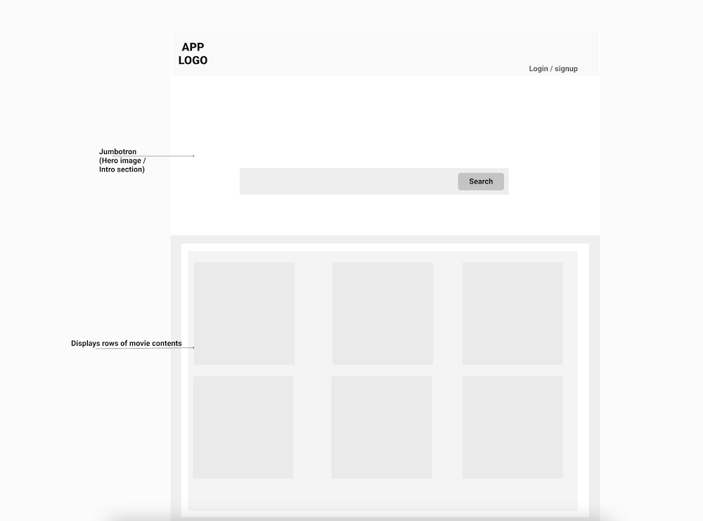
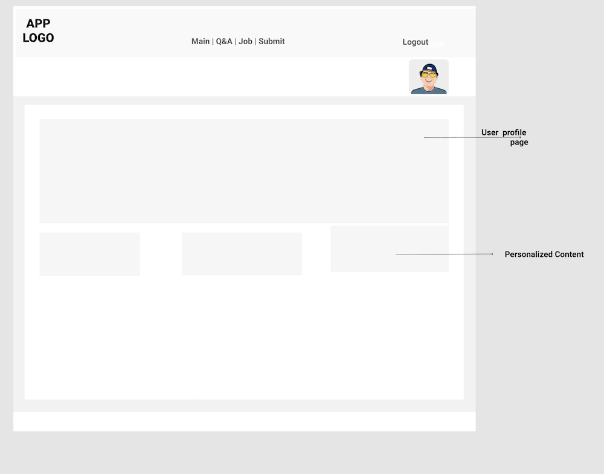
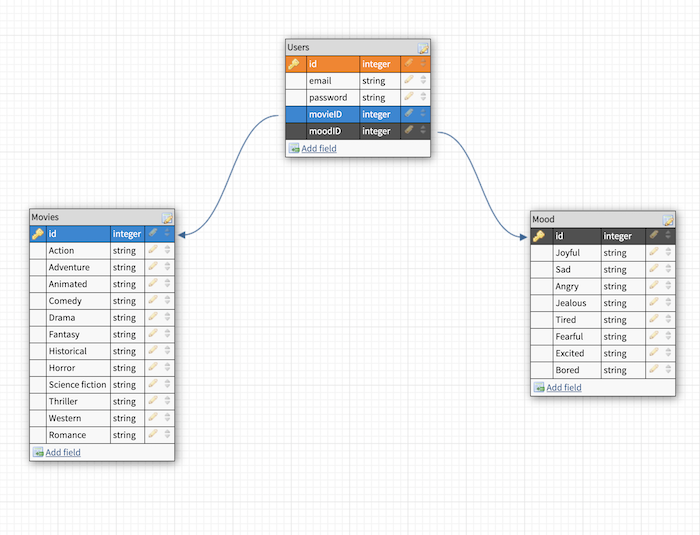

# MoodFlics
A movie recommendation app based on users' moods / emotions. Find the right entertainment content to watch if you are happy, sad, bored, tired, excited, heartbroken. 


# Stack
- MongoDB, React(NextJS), Node | Express, TailwindCSS, OAuth

## Getting Started

First, run the development server:

- Fork and clone repo
- npm install

```bash
npm run dev
# or
yarn dev
```

Open [http://localhost:3000](http://localhost:3000) with your browser to see the result.


### User Stories

- As a user I will be able to search for movies by entering 'How I feel'
- I will be able to browse movies by genre, and get more details about them
- I will be able to login and personalize my searches via user account


### MVP

- Full stack app (frontend / backend setup and config)
- Search functionality
- OAuth - User registration | login


### Stretch Goals
- Make app smarter with Machine Learning


### Related Images

### Home page



### User Account page


### ERD


